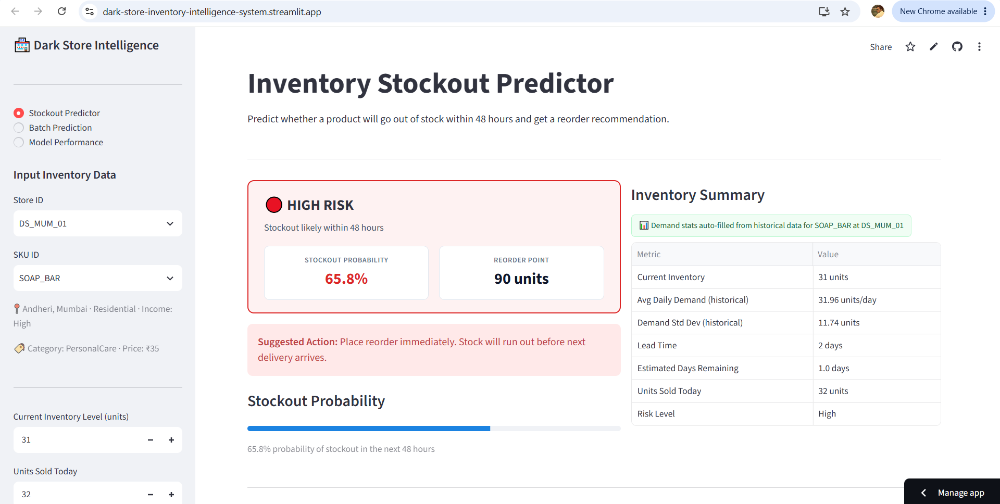
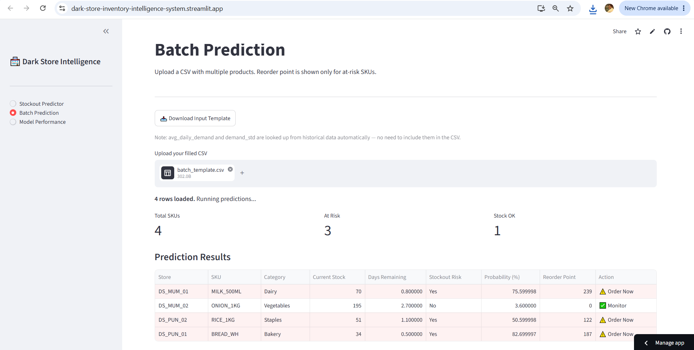
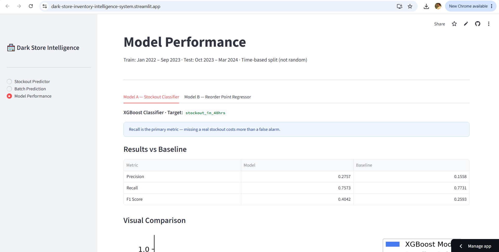

# Dark Store Inventory Intelligence System
### Stockout Prediction + Dynamic Reorder Point

🚀 **Live Demo:** [dark-store-inventory-intelligence.streamlit.app]([your-link-here](https://dark-store-inventory-intelligence-system.streamlit.app/))

An end-to-end machine learning project that predicts whether a dark store SKU will go out of stock within the next 48 hours and recommends a reorder point when risk is high. Built in the context of quick-commerce platforms like Blinkit and Zepto.

---

## Project Structure

```
dark_store_project/
│
├── Data/
│   └── dark_store_inventory_raw.csv         ← raw dataset (start here)
│
├── models/                                   ← saved after running notebook
│   ├── model_stockout.pkl
│   ├── model_reorder.pkl
│   ├── encoders.pkl
│   ├── feature_cols.pkl
│   └── income_map.pkl
│
├── metrics/                                  ← saved after running notebook
│   └── model_metrics.json
│
├── ML_stock_recommendation_system_for_dark_stores.ipynb   ← full ML pipeline
├── app.py                                    ← Streamlit dashboard
├── requirements.txt
└── README.md
```

## Screenshots

### Stockout Predictor — High Risk Result


### Batch Prediction Results


### Model Performance


---

## Problem Statement

Dark stores (micro-fulfillment centers for 10-minute delivery) operate with narrow margins and zero tolerance for stockouts. A stockout means a lost order, a dissatisfied customer, and damage to platform SLA metrics. Traditional inventory management uses fixed reorder rules — the same threshold regardless of demand variability, season, weather, or local events.

This project replaces static rules with a two-model ML system that adapts reorder decisions to actual demand patterns.

---

## Dataset

**Synthetic dataset** generated specifically for this project — 82,100 rows across 5 dark stores, 20 SKUs, and 2+ years (Jan 2022 to Mar 2024).

No suitable public dataset existed with all required columns simultaneously: daily inventory tracking, lead time, replenishment logic, and stockout events with consistent internal arithmetic. The synthetic dataset was built with full inventory mechanics:

- Stock depletes by units sold each day
- Deliveries arrive after lead time from order placement
- Reorder triggers when inventory falls to or below reorder point
- Lost sales recorded when demand exceeds available stock
- Demand multipliers applied for weekends, holidays, IPL season, monsoon, festive period, and neighborhood income level

**Stores:** 5 dark stores across Mumbai, Pune, and Bengaluru with varying area types (Residential, Commercial, Mixed) and income levels.

**SKUs:** 20 products across Dairy, Bakery, Staples, Vegetables, Fruits, Snacks, Beverages, Personal Care, Baby Care, Packaged, and Household categories.

---

## Data Cleaning

The raw dataset was intentionally dirtied to simulate real-world data quality issues:

| Issue | Count | Fix Applied |
|---|---|---|
| Mixed date formats (dd/mm/yyyy vs yyyy-mm-dd) | ~2,400 rows | `pd.to_datetime(format='mixed')` |
| Duplicate rows | 300 | `drop_duplicates()` |
| Negative `units_sold` | 150 | Data entry error — `abs()` |
| Inventory outliers (`9999`) | 80 | System glitch — replace with NaN then forward-fill within store+SKU group |
| Zero prices | 200 | Missing data — fill with SKU median price |
| Missing `income_level` | ~820 rows | Store property — lookup from store_id |
| Missing `lead_time_days` | ~2,060 rows | Supplier property — fill with median per SKU |
| Missing `discount_pct` | ~2,470 rows | No discount assumed — fill with 0 |
| Missing `weather` | ~1,640 rows | Fill with mode per city per month |

**Critical:** Data is sorted by `store_id → sku_id → date` before any cleaning operation. Without this sort, forward-fill and rolling windows produce incorrect results.

---

## Feature Engineering

All features are derived from historical data. No future information is used as model input.

| Feature | Type | Description |
|---|---|---|
| `day_of_week` | Date | 0=Monday to 6=Sunday |
| `month` | Date | 1–12 |
| `is_month_start` | Date | 1 if day ≤ 3 (salary week demand spike) |
| `is_month_end` | Date | 1 if day ≥ 28 |
| `is_ipl_season` | Date | 1 if April or May |
| `season` | Date | Summer / Monsoon / Festive / Winter |
| `lost_sales` | Demand | raw_demand − units_sold (unmet demand) |
| `rolling_avg_7d` | Rolling | 7-day rolling mean of units_sold per store+SKU |
| `rolling_avg_30d` | Rolling | 30-day rolling mean |
| `rolling_std_7d` | Rolling | 7-day demand standard deviation |
| `rolling_std_30d` | Rolling | 30-day demand standard deviation |
| `lag_sales_1d` | Lag | Units sold yesterday |
| `lag_sales_7d` | Lag | Units sold 7 days ago |
| `lag_sales_14d` | Lag | Units sold 14 days ago |
| `lag_inventory_1d` | Lag | Inventory level yesterday |
| `sales_spike_flag` | Signal | 1 if today > 1.5× 7-day average |

**Note:** `days_of_stock_remaining` was intentionally excluded from model features. Although calculable from available data, it almost directly encodes the answer (`inventory / avg_demand < 2` trivially predicts a 48-hour stockout). Including it would make ML unnecessary — a simple rule would match the model. Removing it forces the model to learn from actual demand patterns.

---

## Target Variables

**Target A — `stockout_in_48hrs`** (Classification)
- Label = 1 if `stockout_flag = 1` in current row or within the next 2 rows for the same store+SKU
- `stockout_flag = 1` when inventory ≤ 20% of 7-day rolling average demand
- Positive class rate: ~4% — class imbalance handled via `scale_pos_weight` in XGBoost

**Target B — `reorder_point`** (Regression)
- Calculated using standard inventory science formula:
```
safety_stock  = 1.65 × √(lead_time × demand_std²)
reorder_point = (avg_demand × lead_time) + safety_stock
```
- Z = 1.65 corresponds to 95% service level
- **Common mistake to avoid:** safety stock uses `rolling_std_7d` (demand variability), not `rolling_avg_7d` (demand average)

---

## Train-Test Split

**Rule: Never use random split on time-series data.**

- **Train:** Jan 2022 – Sep 2023
- **Test:** Oct 2023 – Mar 2024

Random split would allow the model to train on future data and test on past data, producing artificially inflated metrics that collapse in production.

---

## Encoding

| Column Type | Columns | Method |
|---|---|---|
| Ordinal | `income_level` | Manual map: Low=0, Medium=1, High=2 |
| Nominal | `store_id`, `city`, `area`, `area_type`, `sku_id`, `category`, `weather`, `season` | LabelEncoder per column |

**Critical:** Encoders are fit on training data only. Test data is transformed using the same fitted encoders. Fitting separately on test data would produce different integer codes — the model would misread the inputs.

---

## Models

### Model A — Stockout Prediction (XGBoost Classifier)

Predicts whether a SKU will stock out within the next 48 hours.

- **Class imbalance:** `scale_pos_weight = count(0) / count(1)` — gives more weight to the minority class (stockouts)
- **Primary metric:** Recall — missing a real stockout (false negative) costs more than a false alarm (false positive)
- **Threshold:** 0.4 probability (not default 0.5) — tuned to favour recall

**Baseline:** Rule-based system that flags stockout if `days_of_stock_remaining < 2`

| Metric | XGBoost Model | Baseline |
|---|---|---|
| Precision | 0.2757 | 0.1558 |
| Recall | 0.7573 | 0.7731 |
| F1 Score | 0.4042 | 0.2593 |

*(Fill in your actual numbers from the notebook output)*

### Model B — Reorder Point Prediction (XGBoost Regressor)

Predicts the inventory level at which a replenishment order should be placed.

- Only runs when Model A predicts stockout risk (at_risk = 1)
- **Baseline:** Direct formula calculation — high error because the formula uses current-day rolling values while the target was created using slightly different historical window states

| Metric | XGBoost Model | Baseline |
|---|---|---|
| RMSE | 2.0837 | 0.4977 |
| MAE | 1.1547 | 0.2477 |
| R² | 0.998 | 0.9999 |

*(Fill in your actual numbers from the notebook output)*

---

## Combined Pipeline

The two models work sequentially:

```
For each SKU at each store:
    │
    ├─ Model A → stockout probability
    │       │
    │       ├─ prob ≥ 0.4 → AT RISK
    │       │      └─ Model B → reorder point
    │       │             └─ Output: "Order when stock hits N units"
    │       │
    │       └─ prob < 0.4 → SAFE
    │              └─ Output: "Monitor. No action needed."
```

Model B never runs for safe SKUs — this mirrors how an inventory manager would actually use the system.

---

## Streamlit Dashboard

Three pages:

**1. Stockout Predictor**
- Select store and SKU from dropdown
- Demand stats (rolling averages, std) are auto-filled from historical data — no manual entry
- Manager inputs only what they know right now: current inventory, units sold today, lead time, discount, weather, season
- Displays stockout probability with a progress bar, inventory summary table, and feature importance chart
- Reorder point shown only when risk is high

**2. Batch Prediction**
- Upload CSV with multiple SKUs
- Predictions run for every row
- Reorder point shown only for at-risk SKUs
- Download results as CSV

**3. Model Performance**
- Precision, Recall, F1 for Model A vs baseline — comparison table and bar chart
- RMSE, MAE, R² for Model B vs baseline — comparison table and bar chart
- Feature importance charts for both models

---

## Setup Instructions

```bash
# 1. Clone or unzip the project
# 2. Create a virtual environment
python -m venv venv

# Windows
venv\Scripts\activate

# Mac/Linux
source venv/bin/activate

# 3. Install dependencies
pip install -r requirements.txt

# 4. Run the Jupyter notebook top to bottom
#    This trains models and saves them to models/ and metrics/ folders
#    Make sure DATA_PATH in the notebook points to your CSV file

# 5. Launch the app
streamlit run app.py
```

**Important:** The `.pkl` files in `models/` must be generated by running the notebook on your own machine. Model files saved in a different environment (different numpy version) will cause a `ModuleNotFoundError: No module named 'numpy._core'` error. Always retrain locally.

---

## Requirements

```
pandas==2.1.4
numpy==1.26.4
scikit-learn==1.4.0
xgboost==2.0.3
streamlit==1.31.0
matplotlib==3.8.2
seaborn==0.13.2
joblib==1.3.2
nbformat==5.9.2
```

---

## Key Design Decisions and Why

| Decision | Reason |
|---|---|
| Synthetic dataset | No public dataset had lead time + daily inventory + replenishment logic with consistent arithmetic |
| Time-based split | Random split on time-series leaks future data into training |
| Recall as primary metric for Model A | Stockout cost > false alarm cost in dark store operations |
| `days_of_stock_remaining` excluded from features | Too directly encodes the answer — trivialises the ML problem |
| Separate encoder per column | Single encoder reused across columns loses class information for all but the last column |
| `rolling_std_7d` in safety stock formula | Standard inventory science — variability drives safety stock, not demand average |
| Model B runs only for at-risk SKUs | Matches real operational workflow — reorder calculation is irrelevant when stock is safe |
| Demand stats auto-filled in app | Asking user to input avg_daily_demand makes a simple calculation possible without ML — historical lookup is more realistic |
